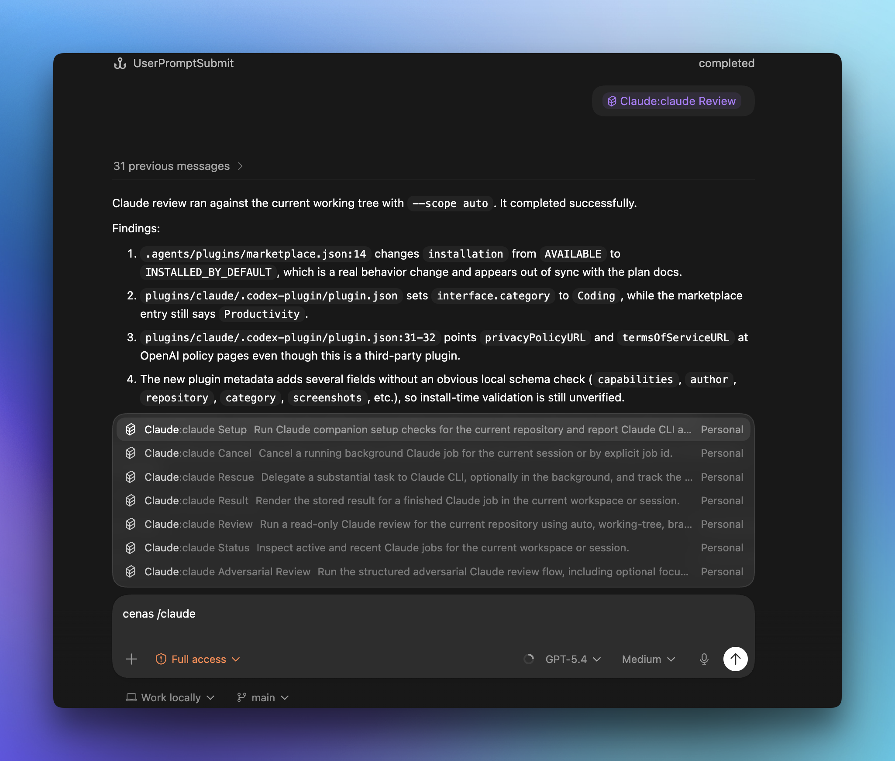

# Claude plugin for Codex

[](https://github.com/nikuscs/codex-cc-plugin/actions/workflows/ci.yml)
[](https://developers.openai.com/codex/plugins/build)

Use Claude from inside Codex for code reviews, adversarial reviews, and delegated Claude tasks.

This plugin is for Codex users who want Claude CLI available as a first-class Codex skill surface.



## What you get

- `claude-setup` to verify Claude CLI install, auth, and runtime state
- `claude-review` for normal read-only Claude review
- `claude-adversarial-review` for steerable challenge review
- `claude-rescue`, `claude-status`, `claude-result`, and `claude-cancel` for delegated work and tracked jobs

## Requirements

- Claude CLI installed and on `PATH`
- Claude CLI authenticated
- Node.js `20+`

## Install

### Codex app

```bash
codex marketplace add nikuscs/codex-cc-plugin
```

This installs the Claude plugin for Codex.

### Codex CLI command

Install the standalone CLI command:

```bash
curl -fsSL https://raw.githubusercontent.com/nikuscs/codex-cc-plugin/main/scripts/install.sh | bash
```

That installs:

- `ccx`
- `claude-codex`

to `~/.local/bin`.

In Codex CLI, use it as a shell command:

```text
!ccx setup
!ccx review
!ccx adversarial-review --focus "challenge the retry logic"
```

### Manual local install

```bash
mkdir -p ~/.codex/plugins ~/.agents/plugins
git clone https://github.com/nikuscs/codex-cc-plugin.git ~/.codex/plugins/codex-cc-plugin
```

Create `~/.agents/plugins/marketplace.json`:

```json
{
  "name": "personal",
  "interface": {
    "displayName": "Personal Plugins"
  },
  "plugins": [
    {
      "name": "claude",
      "source": {
        "source": "local",
        "path": "./plugins/codex-cc-plugin/plugins/claude"
      },
      "policy": {
        "installation": "INSTALLED_BY_DEFAULT",
        "authentication": "ON_INSTALL"
      },
      "category": "Coding"
    }
  ]
}
```

Restart Codex after adding or changing the marketplace entry.

## First run

After install, Codex app should expose the plugin skills in the composer slash-command list.

In the Codex app they may appear with the plugin name prefixed, for example:

- `/Claude:claude Setup`
- `/Claude:claude Review`
- `/Claude:claude Adversarial Review`
- `/Claude:claude Rescue`
- `/Claude:claude Status`
- `/Claude:claude Result`
- `/Claude:claude Cancel`

Look for:

- `claude-setup`
- `claude-review`
- `claude-adversarial-review`
- `claude-rescue`
- `claude-status`
- `claude-result`
- `claude-cancel`

You can invoke them either from the slash-command picker or by asking Codex to use the skill directly.

Try:

```text
Use the skill claude-setup
```

If Codex runs the command or skill instead of searching for `SKILL.md`, the plugin is installed correctly.

`claude-setup` will tell you whether Claude is ready. If Claude is installed but not logged in yet, run:

```bash
claude auth status
```

## Usage

### `claude-review`

Runs a normal Claude review on your current work.

Examples:

```text
Use the skill claude-review
Use the skill claude-review with base main
```

You can also run it from the slash-command picker after install, for example `/Claude:claude Review`.

### `claude-adversarial-review`

Runs a steerable review that challenges the current design or implementation.

Examples:

```text
Use the skill claude-adversarial-review and focus on race conditions
Use the skill claude-adversarial-review and challenge whether this caching approach is safe
```

This also appears as a slash-command surface after install.

### `claude-rescue`

Hands a substantial task to Claude through the tracked runtime.

Examples:

```text
Use the skill claude-rescue to investigate why the tests are failing
Use the skill claude-rescue to refactor the module in the background
```

This also appears as a slash-command surface after install.

### `claude-status`, `claude-result`, `claude-cancel`

Use these to inspect, fetch, or stop tracked Claude jobs.

## Codex CLI usage

Use the standalone binary from Codex CLI with `!ccx ...`.

Examples:

```text
!ccx setup
!ccx review
!ccx task --write "Fix the failing tests"
!ccx status
```

## Runtime check

From shell:

```bash
ccx setup
```

## Typical flows

### Review before shipping

```text
/Claude:claude Review
```

### Challenge a design before merging

```text
/Claude:claude Adversarial Review
```

### Hand a larger task to Claude

```text
/Claude:claude Rescue
```

### Use the CLI command from Codex CLI

```text
!ccx review
!ccx task --write "Fix the failing tests"
```

## Development

Run the full local check suite:

```bash
bun install
bun run check
```

That runs:

- `oxlint`
- `oxfmt --check`
- `node --test tests/runtime.test.mjs`
- `bun run build:cli`

## Project docs

- [CONTRIBUTING.md](/Users/jon/projects/codex-cc-plugin/CONTRIBUTING.md)
- [SECURITY.md](/Users/jon/projects/codex-cc-plugin/SECURITY.md)
- [CODE_OF_CONDUCT.md](/Users/jon/projects/codex-cc-plugin/CODE_OF_CONDUCT.md)
- [LICENSE](/Users/jon/projects/codex-cc-plugin/LICENSE)
- [PRIVACY.md](/Users/jon/projects/codex-cc-plugin/PRIVACY.md)
- [TERMS.md](/Users/jon/projects/codex-cc-plugin/TERMS.md)
- [TRADEMARKS.md](/Users/jon/projects/codex-cc-plugin/TRADEMARKS.md)

## Credits

- Original inspiration: [openai/codex-plugin-cc](https://github.com/openai/codex-plugin-cc)
- This repo ports that workflow idea in the opposite direction for Codex and Claude CLI.

## FAQ

### Do I need a separate Claude account for this plugin?

No separate account for the plugin itself. You need a working local Claude CLI session on the machine where Codex is running.

If Claude CLI is already installed and authenticated, this plugin should work immediately. If not, run:

```bash
claude auth status
```

### Does the plugin use a separate Claude runtime?

No. It delegates through your local Claude CLI installation on the same machine.

That means:

- it uses the same Claude CLI binary you would run directly
- it uses the same local Claude authentication state
- it runs against the same repository checkout and local machine environment

### Will it use the same local Claude setup I already have?

Yes. This plugin is a thin Codex surface around your local Claude CLI workflow.

If you already use Claude CLI directly, the plugin reuses that install instead of shipping a separate Claude runtime.

### Does Codex CLI use slash commands for this plugin?

Codex app exposes the plugin skills as slash-command surfaces.

Codex CLI should be treated differently: use the installed standalone command through shell invocation:

```text
!ccx setup
!ccx review
```

### Does the plugin install repo hooks everywhere?

No. Repo-level hooks in `.codex/hooks.json` are workspace-local.

Installing the plugin does not automatically copy those hooks into every repository you use.

## Legal

- License: [LICENSE](/Users/jon/projects/codex-cc-plugin/LICENSE)
- Privacy: [PRIVACY.md](/Users/jon/projects/codex-cc-plugin/PRIVACY.md)
- Terms: [TERMS.md](/Users/jon/projects/codex-cc-plugin/TERMS.md)
- Trademarks and branding notes: [TRADEMARKS.md](/Users/jon/projects/codex-cc-plugin/TRADEMARKS.md)
